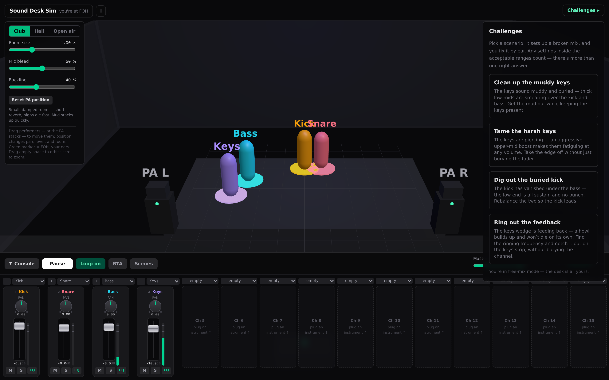
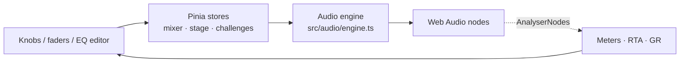
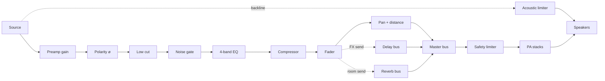

# Sound Desk Sim

A live-sound mixing desk that runs in your browser. Put a band on a virtual
stage, drag the performers around, and mix them through a real channel strip —
gain, EQ, gate, compressor, faders — into a PA you can hear. Learn what every
knob does by turning it.

Built with Vue 3, Pinia, and the Web Audio API. No plugins, no backend,
installable as a PWA.



## Quick start

```sh
bun install
bun run dev
```

Open the printed URL and click **Play**. (Browsers keep audio suspended until
you interact — Play is that gesture.) Turn your volume down first.

## Features

- **Real signal chain** — every channel runs through preamp gain, polarity
  invert, low cut, a noise gate, 4-band EQ, a compressor, pan, and a fader,
  into a master bus with an always-on safety limiter.
- **Live stage** — drag performers around the room and hear position as pan,
  level, and reverb. Pick a venue (club / hall / open air) and scale it.
- **16-channel console** — Midas-M32R-inspired desk with rotary knobs,
  vertical faders, DCA groups, scenes, solo/mute, FX sends, and a graphical
  EQ editor per channel.
- **Real-time analyzer** — spectrum view with live EQ curves and
  gain-reduction meters straight from the audio engine.
- **Realistic behavior** — mic bleed between performers, acoustic backline
  that bypasses the console, and a feedback-ringout challenge that actually
  howls until you notch it out.
- **Challenges** — guided scenarios that create a problem (a muddy pad, a
  buried kick) for you to fix by ear, with tolerance-based validation,
  directional hints, and A/B comparison.

## How it works

The UI never touches the audio nodes directly. Components write to a Pinia
store, the store calls the engine, and the engine sets Web Audio parameters
with click-free ramps:



Each channel is an ordered chain of Web Audio nodes ending at the master bus.
The stage also feeds an acoustic backline path that bypasses the console
entirely, and both paths end in an always-on safety limiter:



## Bring your own audio

The app synthesizes its own instruments, so it makes sound with zero external
files. To mix real material, drop files into
[`public/stems/`](public/stems/README.md) named `kick`, `bass`, `pad`
(`.wav` or `.mp3`). Channels that find a file use it; the rest fall back to
the synth.

## Development

```sh
bun run dev        # dev server
bun run typecheck  # type-check with vue-tsc
bun run test       # unit tests
bun run test:e2e   # Playwright smoke tests
bun run build      # typecheck + production build
bun run preview    # preview the build
```

New contributor? See [CONTRIBUTING.md](CONTRIBUTING.md) for setup, the code
layout, and conventions, plus the [Code of Conduct](CODE_OF_CONDUCT.md).

## Authoring a challenge

Challenges are plain data. Append an object to the array in
[`src/challenges/data.ts`](src/challenges/data.ts) and it shows up in the
picker. See [`src/challenges/types.ts`](src/challenges/types.ts) for the shape.

## License

[MIT](LICENSE)
